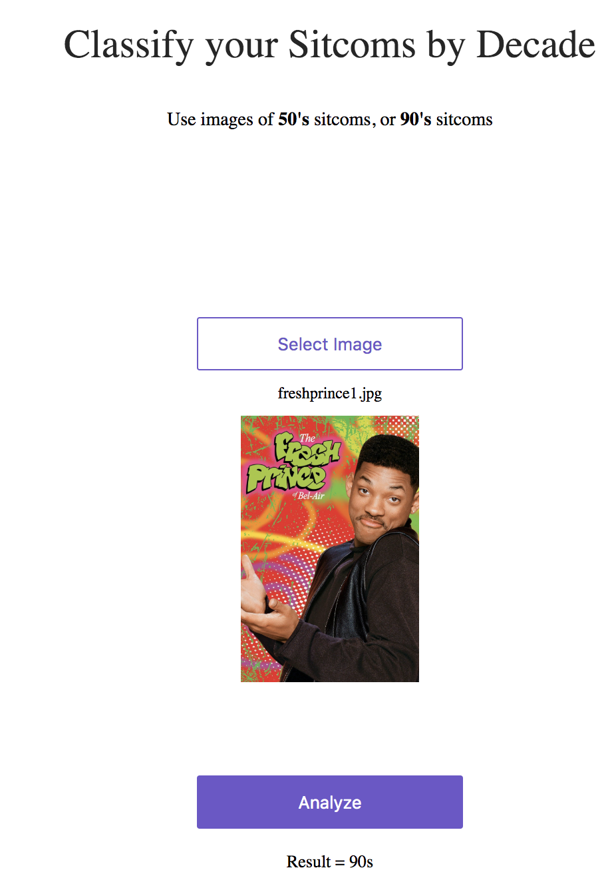

# Sitcom Classifier
This repo tweaks the starter files by [fast.ai](https://www.fast.ai) to deploy a CNN trained on fashion images to then classify 50s and 90s sitcoms with ~90% accuracy. Check out the model working live on [Render](https://sitcom-classifier.onrender.com/) 

For the original repo see here: deploying [fast.ai](https://github.com/fastai/fastai) models on Render.

